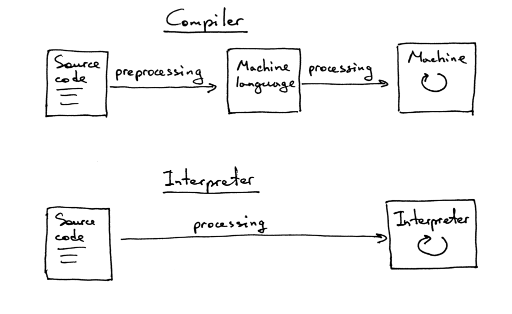

# 从零开始写个简单的解释器（1）
原文：[Let’s Build A Simple Interpreter. Part 1.](https://ruslanspivak.com/lsbasi-part1/)

译文：

> ”如果你不知道编译器是如何工作的，那么你就不知道计算机是如何工作的。如果你不能百分百确定你是否知道编译器是如何工作的，那么你就不知道编译器是如何工作的。“- Steve Yegge

道理摆在这里。仔细想想。无论你是新手还是老练的软件开发者，这并不重要：如果你不知道编译器和解释器是如何工作的，那么你就不知道计算机是如何工作的。就这么简单。

那么，你知道编译器和解释器是如何工作的吗？我的意思是，你100%确定你知道它们是如何工作的吗？如果你不知道。


或者说，如果你不知道，而且你真的为此而感到很焦躁。


不要担心。如果你坚持做完这一系列，和我一起打造一个解释器和编译器，最终你就会知道它们是如何工作的。而且你也会成为自己的成就感到高兴和满意。至少我希望如此。


为什么要研究解释器和编译器？我给你找到三个理由。

1. 要编写一个解释器或编译器，你必须要有很多技术技能，而且这些技能需要你一起使用。编写解释器或编译器将帮助你提高这些技能，从而成为一个更好的软件开发人员。同样，你所学的技能在编写任何软件时都是有用的，而不仅仅是解释器或编译器。
2. 你真的想知道计算机是如何工作的。通常情况下，解释器和编译器看起来就像某种魔法一样。而你不应该安于这种魔法。你想解开解释器和编译器的构建过程，了解它们是如何工作的，并掌握事情的控制权。
3. 你想创建自己的编程语言或特定领域的语言。如果你创建了一门语言，你还需要为它创建一个解释器或编译器。最近，人们对新的程序设计语言的兴趣又开始复苏了。而你几乎每天都能看到一种新的编程语言出现。Elixir、Go、Rust只是其中的几个例子。

好吧，但是什么是解释器和编译器？

使用**解释器**或**编译器**的目的是将源程序以某种高级语言翻译成其他形式。是不是一头雾水？稍微忍耐一下，在本系列的后面，你会了解到源程序到底被翻译成了什么。

这时，你可能还想知道解释器和编译器之间有什么区别。在本系列里面，让我们约定，如果一个翻译器将源程序翻译成机器语言，那么它就是一个**编译器**。如果一个翻译器在不先将源程序翻译成机器语言的情况下处理和执行源程序，那么它就是一个**解释器**。直观上，它看起来是这样的。



希望到现在我已经让你已经确信，你真的想研究并且构建一个解释器和编译器。你能从这一系列课程中选到关于的解释器哪些知识呢？

具体来说是这样的：你和我将创建一个简单的，可用于Pascal语言的一个大的子集的解释器。在这个系列的最后，你将拥有一个完全可以工作的Pascal解释器和一个像Python的pdb那样的源码级调试工具。

你可能会问，为什么要用Pascal语言？首先，它并不是我为了这个系列而创造出来的语言：它是一门真正的编程语言，有很多重要的语言构造。而且一些老的、但很有用的CS书中都用Pascal编程语言来做例子（我明白这不是一个特别有说服力的理由来选择一种语言来构建解释器，但我觉得学习一种非主流的语言也是不错的改变：)

这里有一个Pascal中的阶乘函数的例子，你到时候可以用你自己的解释器来解释，并使用你将创建的交互式源码级调试工具进行调试。

```pascal
program factorial;

function factorial(n: integer): longint;
begin
    if n = 0 then
        factorial := 1
    else
        factorial := n * factorial(n - 1);
end;

var
    n: integer;

begin
    for n := 0 to 16 do
        writeln(n, '! = ', factorial(n));
end.
```

我们的Pascal解释器的实现语言将是用 Python 实现的，但你可以使用任何你想要的语言，因为所使用的思想并不依赖于任何特定的语言实现。好了，让我们进入正题。预备，准备，开始！

你将通过编写一个简单的算术表达式解释器，也被称为计算器，开始你对解释器和编译器的第一次尝试。今天的目标是相当简单：让你的计算器处理两个单数整数的加法，比如3+5。 下面是你的计算器的源代码，对不起，是解释器的源码：

```python
# 标记（Token）类型
#
# 标记EOF(end-of-file)用于表示
# 没有更多的输入需要进行词法分析。
INTEGER, PLUS, EOF = 'INTEGER', 'PLUS', 'EOF'


class Token(object):
    def __init__(self, type, value):
        # 标记类型: INTEGER, PLUS, or EOF
        self.type = type
        # 标记的值: 0, 1, 2. 3, 4, 5, 6, 7, 8, 9, '+', or None
        self.value = value

    def __str__(self):
        """类实例的字符串表示。

        例子：
            Token(INTEGER, 3)
            Token(PLUS '+')
        """
        return 'Token({type}, {value})'.format(
            type=self.type,
            value=repr(self.value)
        )

    def __repr__(self):
        return self.__str__()


class Interpreter(object):
    def __init__(self, text):
        # 输入的字符串，如： "3+5"
        self.text = text
        # self.pos为指向self.text的索引
        self.pos = 0
        # 当前标记的实例
        self.current_token = None

    def error(self):
        raise Exception('Error parsing input')

    def get_next_token(self):
        """词法分析器（也叫做扫描器或者分词器）

        此方法负责将句子拆分成一个个标记。一次一个标记。
        """
        text = self.text

        # self.pos的索引是否超过了self.text的末尾？
        # 如果是，则返回EOF令牌，因为没有其他的
        # 字符串需要转换成标识了
        if self.pos > len(text) - 1:
            return Token(EOF, None)

        # 在self.pos的位置获取一个字符，然后
        # 根据这个字符来创建标记
        current_char = text[self.pos]

        # 如果这个字符是数字那就转换成整数，
        # 然后创建整数（INTEGER）的标记，将self.pos的索引推进
        # 到当前数字的下一个字符，
        # 然后返回 INTEGER 标记
        if current_char.isdigit():
            token = Token(INTEGER, int(current_char))
            self.pos += 1
            return token

        if current_char == '+':
            token = Token(PLUS, current_char)
            self.pos += 1
            return token

        self.error()

    def eat(self, token_type):
        # 比较当前标记的类型与传递进来的标记的类型，
        # 如果两者匹配，则 "吃掉"（eat）当前标记，
        # 并获取下一个标记分配给self.current_token，
        # 否则会抛出异常。
        if self.current_token.type == token_type:
            self.current_token = self.get_next_token()
        else:
            self.error()

    def expr(self):
        """expr -> INTEGER PLUS INTEGER"""
        # 从输入中获取第一个标记并把它当作当前标记
        self.current_token = self.get_next_token()

        # 我们期望当前的标记是一个只有一位数的整数
        left = self.current_token
        self.eat(INTEGER)

        # 我们期望当前的标记是一个'+'号
        op = self.current_token
        self.eat(PLUS)

        # 我们期望当前的标记是一个只有一位数的整数
        right = self.current_token
        self.eat(INTEGER)
        # 经过所有上述过程之后self.current_token会被设为EOF标记

        # 至此所有的标记都成功地按照 INTEGER PLUS INTEGER 的顺序被找到
        # 方法只需返回两个整数相加的结果。这样我们就成功实现了对终端
        # 输入的解释
        result = left.value + right.value
        return result


def main():
    while True:
        try:
            # 在python3环境下，使用“input”代替“raw_input”
            text = raw_input('calc> ')
        except EOFError:
            break
        if not text:
            continue
        interpreter = Interpreter(text)
        result = interpreter.expr()
        print(result)


if __name__ == '__main__':
    main()
```
将上面的代码保存到 calc1.py 文件中，或者直接从 GitHub 上下载。在你开始深入研究代码之前，在命令行上运行计算器程序，看看它是怎么运行的。尽管把玩一番! 下面是我的笔记本电脑上运行的一个例子(如果你想在 Python3 下运行计算器，你需要将 raw_input 替换为 input)。

```cmd
$ python calc1.py
calc> 3+4
7
calc> 3+5
8
calc> 3+9
12
calc>
```
为了使你的简单计算器能够正常工作而不抛出异常，你的输入需要遵循一定的规则。

* 在输入中只允许输入个位数整数
* 目前唯一支持的算术运算是加法。
* 输入中的任何地方都不允许有空格字符。
  
加入这些必要的限制是为了让计算器变得简单。别担心，你很快就会把它变得相当复杂。

好了，现在让我们深入了解一下你的解释器是如何工作的，以及它是如何对算术表达式求值的。

当你在命令行输入一个表达式3+5时，你的解释器会得到一个字符串 "3+5"。为了让解释器能够真正理解如何处理这个字符串，它首先需要将输入的 "3+5 "分解为称为**标记**的组件。**标记**是一个对象，它有一个类型和一个值。例如，对于字符串 "3"，标记的类型是INTEGER，对应的值是整数3。

将输入字符串分解成令牌的过程被称为**词法分析**。所以，你的解释器需要做的第一步就是读取输入的字符，并将其转换为标记流。解释器中做这个工作的部分被称为**词法分析器**，简称**分词器**。你可能也会遇到其他的叫法，如**扫描器**或**标记器**  。它们的意思都是一样的：解释器或编译器中把输入的字符变成标记流的部分。

*Interpreter* 类中的 *get_next_token* 方法就是你的词法分析器。每次调用它，你都会得到从传递给解释器的字符输入中创建的下一个标记。让我们仔细观察一下这个方法本身，看看它是如何将字符转换为标记的。输入被存储在保存输入字符串的变量 *text* 中，*pos* 是字符串的索引（把字符串看作是一个字符数组）。*pos* 的初始值为0，指向字符‘3’。该方法首先检查该字符是否是一个数字，如果是，则递增pos，并返回一个标记实例，其类型为INTEGER，值为字符串'3'的整数值，即整数3。

