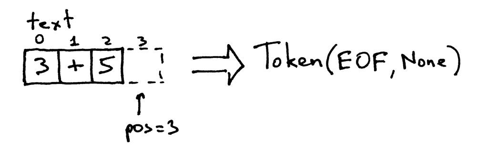

# 从零开始写个简单的解释器（1）
原文：[Let’s Build A Simple Interpreter. Part 1.](https://ruslanspivak.com/lsbasi-part1/)

译文：

> ”如果你不知道编译器是如何工作的，那么你就不知道计算机是如何工作的。如果你不能百分百确定你是否知道编译器是如何工作的，那么你就不知道编译器是如何工作的。“- Steve Yegge

这句话道出了真理。无论你是新手还是经验丰富的软件开发者，这都不重要：如果你不了解编译器和解释器的工作原理，那么你就不了解计算机的工作原理。就这么简单。

那么，你知道编译器和解释器是如何工作的吗？我的意思是，你100%确定自己知道它们的工作原理吗？如果你不确定。


或者说，如果你不知道，而且因此感到焦虑。


不要担心。如果你坚持完成这一系列课程，跟我一起打造一个解释器和编译器，最终你就会明白它们的工作原理。而且你会为自己的成就感到高兴和满足。至少我希望如此。


为什么要研究解释器和编译器？我给你三个理由。

1. 编

写解释器或编译器需要你掌握许多技术技能，并在实践中综合运用。这将帮助你提升这些技能，成为更优秀的软件开发人员。此外，这些技能不仅在编写解释器或编译器时有用，在编写任何软件时都很有帮助。
2. 你真的想了解计算机的工作原理。通常情况下，解释器和编译器看起来像某种魔法，而你不应满足于这种魔法的神秘感。你应该揭开解释器和编译器的构建过程，了解它们的工作原理，掌握其中的奥秘。
3. 你想创建自己的编程语言或特定领域的语言。如果你创建了一门语言，你还需要为它创建一个解释器或编译器。最近，对新编程语言的兴趣重新兴起，你几乎每天都能看到一种新的编程语言出现。Elixir、Go、Rust只是其中的几个例子。

那么，什么是解释器和编译器？

解释器或编译器的目的是将某种高级语言的源程序翻译成其他形式。这让人有些困惑？别急，随着本系列的进行，你会逐渐明白源程序到底被翻译成了什么。

你可能还想知道解释器和编译器之间的区别。在本系列中，我们约定，如果一个翻译器将源程序翻译成机器语言，那么它就是一个**编译器**。如果一个翻译器不将源程序翻译成机器语言就直接处理和执行源程序，那么它就是一个**解释器**。直观上，它们看起来是这样的。


希望现在你已经被说服，确实想研究并构建一个解释器和编译器。那么你能从这系列课程中学到哪些关于解释器的知识呢？

具体来说，我们将创建一个简单的、支持Pascal语言大部分子集的解释器。在本系列的最后，你将拥有一个完全可以工作的Pascal解释器和一个类似Python pdb的源码级调试工具。

你可能会问，为什么用Pascal语言？首先，这不是我为这个系列创造的语言，而是一门真正的编程语言，拥有许多重要的语言结构。而且，一些经典但有用的计算机科学书籍中经常用Pascal做例子（虽然这不是一个特别有说服力的理由，但学习一门非主流语言也是一种有趣的体验：）

这里有一个Pascal中阶乘函数的例子，到时候你可以用自己的解释器来解释，并使用你将创建的交互式源码级调试工具进行调试。

```pascal
program factorial;

function factorial(n: integer): longint;
begin
    if n = 0 then
        factorial := 1
    else
        factorial := n * factorial(n - 1);
end;

var
    n: integer;

begin
    for n := 0 to 16 do
        writeln(n, '! = ', factorial(n));
end.
```

我们的Pascal解释器将用Python实现，但你可以使用任何你喜欢的语言，因为所用的思想并不依赖于特定的语言实现。好了，进入正题。预备，开始！

你将通过编写一个简单的算术表达式解释器（也叫计算器）开始你对解释器和编译器的第一次尝试。今天的目标很简单：让你的计算器处理两个单数整数的加法，比如3+5。下面是你的计算器的源代码，对不起，是解释器的源码：

```python
# 标记（Token）类型
#
# 标记EOF(end-of-file)用于表示
# 没有更多的输入需要进行词法分析。
INTEGER, PLUS, EOF = 'INTEGER', 'PLUS', 'EOF'


class Token(object):
    def __init__(self, type, value):
        # 标记类型: INTEGER, PLUS, or EOF
        self.type = type
        # 标记的值: 0, 1, 2. 3, 4, 5, 6, 7, 8, 9, '+', or None
        self.value = value

    def __str__(self):
        """类实例的字符串表示。

        例子：
            Token(INTEGER, 3)
            Token(PLUS '+')
        """
        return 'Token({type}, {value})'.format(
            type=self.type,
            value=repr(self.value)
        )

    def __repr__(self):
        return self.__str__()


class Interpreter(object):
    def __init__(self, text):
        # 输入的字符串，如： "3+5"
        self.text = text
        # self.pos为指向self.text的索引
        self.pos = 0
        # 当前标记的实例
        self.current_token = None

    def error(self):
        raise Exception('Error parsing input')

    def get_next_token(self):
        """词法分析器（也叫扫描器或分词器）

        此方法负责将句子拆分成一个个标记。一次一个标记。
        """
        text = self.text

        # self.pos的索引是否超过了self.text的末尾？
        # 如果是，则返回EOF令牌，因为没有其他的
        # 字符需要转换成标记了
        if self.pos > len(text) - 1:
            return Token(EOF, None)

        # 在self.pos的位置获取一个字符，然后
        # 根据这个字符来创建标记
        current_char = text[self.pos]

        # 如果这个字符是数字则转换成整数，
        # 然后创建整数（INTEGER）的标记，将self.pos的索引推进
        # 到当前数字的下一个字符，
        # 然后返回 INTEGER 标记
        if current_char.isdigit():
            token = Token(INTEGER, int(current_char))
            self.pos += 1
            return token

        if current_char == '+':
            token = Token(PLUS, current_char)
            self.pos += 1
            return token

        self.error()

    def eat(self, token_type):
        # 比较当前标记的类型与传递进来的标记类型，
        # 如果匹配，则 "吃掉"（eat）当前标记，
        # 并获取下一个标记分配给self.current_token，
        # 否则抛出异常。
        if self.current_token.type == token_type:
            self.current_token = self.get_next_token()
        else:
            self.error()

    def expr(self):
        """expr -> INTEGER PLUS INTEGER"""
        # 从输入中获取第一个标记并将其设为当前标记
        self.current_token = self.get_next_token()

        # 期望当前标记是一个只有一位数的整数
        left = self.current_token
        self.eat(INTEGER)

        # 期望当前标记是一个'+'号
        op = self.current_token
        self.eat(PLUS)

        # 期望当前标记是一个只有一位数的整数
        right = self.current_token
        self.eat(INTEGER)
        # 经过上述过程后self.current_token会被设为EOF标记

        # 至此所有标记都按照 INTEGER PLUS INTEGER 的顺序被找到
        # 方法返回两个整数相加的结果。这样我们就成功实现了对输入的解释
        result = left.value + right.value
        return result


def main():
    while True:
        try:
            # 在Python 3中，使用“input”代替“raw_input”
            text = input('calc> ')
        except EOFError:
            break
        if not text:
            continue
        interpreter = Interpreter(text)
        result = interpreter.expr()
        print(result)


if __name__ == '__main__':
    main()
```
将上面的代码保存到calc1.py文件中，或直接从GitHub下载。在深入研究代码之前，在命令行上运行计算器程序，看看它是如何运行的。尽情尝试！下面是我在笔记本电脑上运行的一个例子（如果你在Python 3下运行计算器，需要将raw_input替换为input）。

```cmd
$ python calc1.py
calc> 3+4
7
calc> 3+5
8
calc> 3+9
12
calc>
```
为了使你的简单计算器能够正常工作而不抛出异常，你的输入需要遵循一些规则。

* 输入中只允许个位数整数
* 目前唯一支持的算术运算是加法
* 输入中的任何地方不允许有空格字符
  
加入这些限制是为了让计算器更简单。别担心，很快你就会让它变得更复杂。

好了，现在让我们深入了解一下你的解释器是如何工作的，以及它是如何对算术表达式求值的。

当你在命令行输入一个表达式3+5时，你的解释器会得到一个字符串 "3+5"。为了让解释器真正理解如何处理这个字符串，它首先需要将输入的 "3+5" 分解为称为**标记**的组件。**标记**是一个对象，包含一个类型和一个值。例如，对于字符串 "3"，标记的类型是INTEGER，对应的值是整数3。

将输入字符串分解成标记的过程称为**词法分析**。所以，解释器需要做的第一步就是读取输入的字符，并将其转换为标记流。解释器中执行这个任务的部分称为**词法分析器**，简称**分词器**。你可能也会遇到其他叫法，如**扫描器**或**标记器**，意思相同：解释器或编译器中将输入的字符变成标记流的部分。

*Interpreter* 类中的 *get_next_token* 方法就是你的词法分析器。每次调用它，你都会得到由输入字符生成的下一个标记。让我们仔细看看这个方法是如何将字符转换为标记的。输入被存储在 *text* 变量中，*pos* 是字符串的索引（把字符串看作字符数组）。*pos* 的初始值为0，指向字符‘3’。该方法首先检查该字符是否是数字，如果是，则递增pos，并返回一个标记实例，类型为INTEGER，值为字符串'3'的整数值，即整数3：

pos现在指向文本中的'+'字符。下次调用该方法时，它会测试pos位置上的字符是否是数字，然后测试该字符是否是加号，实际上是的，该方法会递增pos，并返回一个新创建的标记，类型为PLUS，值为'+'：

pos现在指向字符'5'。当你再次调用get_next_token方法时，该方法会检查它是否是数字，而它确实是数字，所以它递增pos并返回一个新的INTEGER标记，值为整数5：

因为pos索引已经超过了字符串 "3+5" 的末端，所以每次调用get_next_token方法都会返回EOF标记：

动手试试看，看看你的计算器的分词器是如何工作的：
```python
>>> from calc1 import Interpreter
>>>
>>> interpreter = Interpreter('3+5')
>>> interpreter.get_next_token()
Token(INTEGER, 3)
>>>
>>> interpreter.get_next_token()
Token(PLUS, '+')
>>>
>>> interpreter.get_next_token()
Token(INTEGER, 5)
>>>
>>> interpreter.get_next_token()
Token(EOF, None)
>>>
```
所以，现在你的解释器可以访问由输入字符组成的标记流，它需要在从分词器的 *get_next_token* 获取的标记流中找到相应的结构。你的解释器预期在这个流中找到以下结构：INTEGER -> PLUS -> INTEGER。也就是说，它试图找到一个标记序列：整数后面是加号，再后面是整数。

负责查找和解释该结构的方法是 *expr*。该方法验证标记序列是否符合预期，即INTEGER -> PLUS -> INTEGER。当它成功确认了这个结构后，它通过将 PLUS 左边和右边标记的值相加来解释输入的算术表达式。

*expr* 方法使用辅助方法 *eat* 来验证传递给它的标记类型是否与当前标记类型匹配。匹配后，*eat* 方法获取下一个标记，并将其分配给 *current_token* 变量，从而 "吃掉" 当前匹配的标记，并推进标记流中的虚指针。如果标记流的结构不符合预期的 INTEGER PLUS INTEGER 顺序，*eat* 方法会抛出异常。

让我们回顾一下你的解释器是如何对算术表达式求值的。

- 解释器接受一个输入字符串，例如 "3+5"
- 解释器调用 *expr* 方法，在词法分析器 *get_next_token* 返回的标记流中找到一个结构。它试图找到的结构是 *INTEGER PLUS INTEGER*。确认该结构后，通过将两个INTEGER标记的值相加来对输入求值，因为到目前为止，解释器明白需要将两个整数——3和5——相加。

恭喜你！你刚刚学会了如何打造你的第一个解释器！

练习时间


你不会以为光看了这篇文章就够了吧？赶紧动手做下面的练习吧。

1. 修改代码，允许输入多位数整数，例如 "12+3"
2. 添加忽略空格字符的方法，这样计算器可以处理带空格的输入，如 "12 + 3"
3. 修改代码，用 "-" 代替 "+" 处理减法，如 "7-5"

## 检查你是否完全理解了

1. 什么是解释器？
2. 什么是编译器？
3. 解释器和编译器有什么区别？
4. 什么是标记？
5. 将输入分割成标记的过程叫什么？
6. 解释器中做词法分析的部分叫什么？
7. 解释器或编译器的那部分还有哪些常见名称？

在我写完这篇文章之前，我真的希望你能认真研究解释器和编译器。我希望你现在就去做。不要把它抛到脑后。别等了。如果你已经略读了这篇文章，就从头再来。如果你已经仔细阅读了，但还没有做练习——现在就去做。如果你只做了部分练习，那就把剩下的做完。你明白了吗？今天就签署承诺书，开始学习解释器和编译器吧！

我，_______，在此承诺，从今天开始，我承诺学习解释器和编译器，并将达到100%了解它们的工作原理的程度。

签名：

日期：


签上名字，写上日期，并把它放在每天都能看到的地方，以确保你坚持承诺。牢记承诺的定义。

>承诺就是即使在你已经离当时说话的心境很久以后，仍然做你说过你要做的事情。