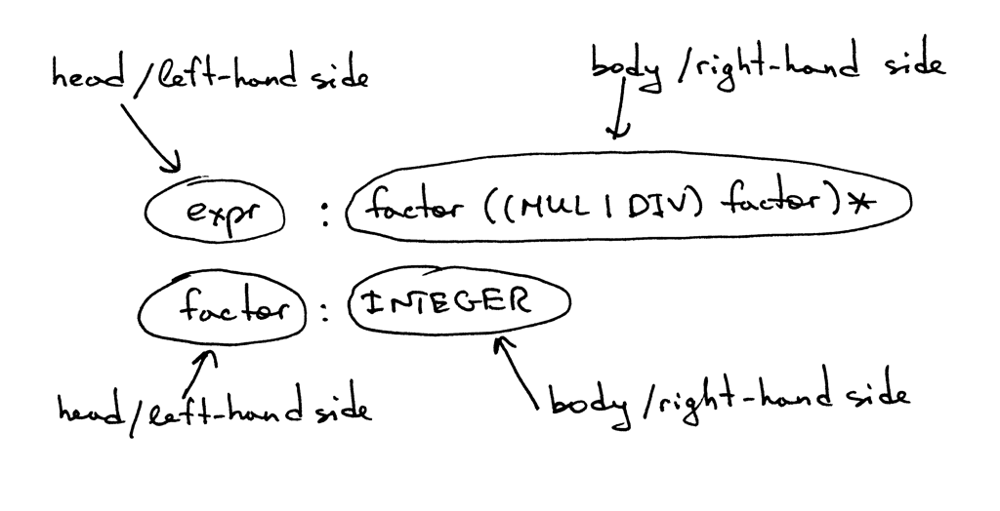
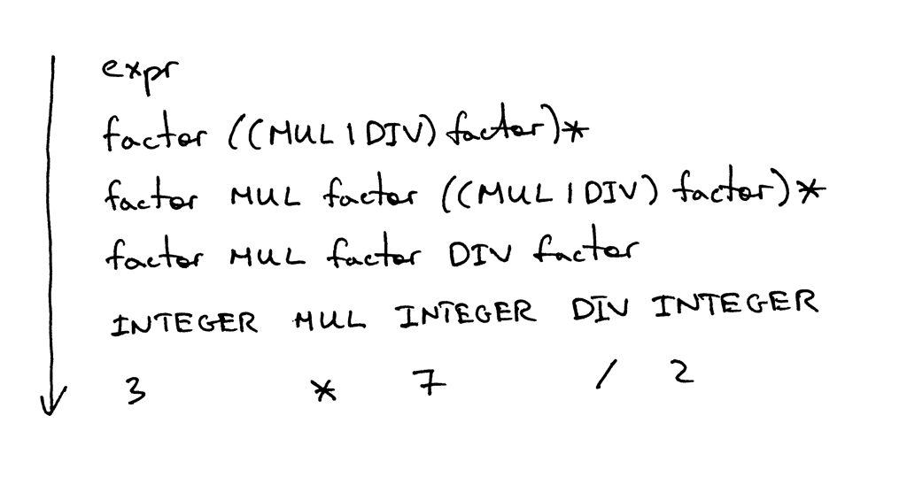
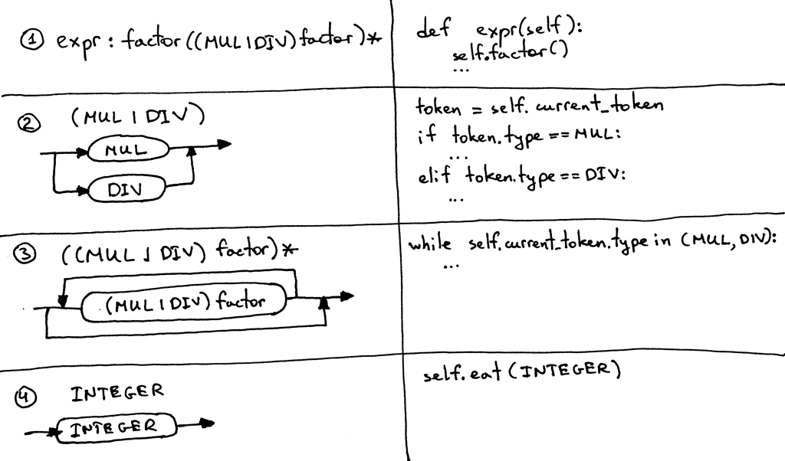

# 从零开始写个简单的解释器（4）

原文：[Let’s Build A Simple Interpreter. Part 4.](https://ruslanspivak.com/lsbasi-part4/)

译文：
你是被动地学习这些文章中的材料，还是一直在积极实践？我希望你一直在积极实践。我真的是这样想的 :)

还记得孔子说过什么吗？( 其实为孔子的弟子荀子在《儒孝篇》中的名句)
>不闻不若闻之

>闻之不若见之

>见之不若知之，知之不若行之

在上一篇文章中，你学习了如何解析（识别）和解释含有任意数量加减运算符的算术表达式，例如 "7 - 3 + 2 - 1"。你还学习了语法图，以及如何使用它们来确定编程语言的语法。

今天你要学习的是如何解析和解释其中包含任意数量的乘法和除法运算符的算术表达式，例如 "7 * 4 / 2 * 3"。本文中的除法将是整数除法，所以如果表达式是 "9 / 4"，那么答案将是一个整数：2。

今天我还会讲不少关于另一种被广泛使用的用于指定编程语言语法的符号。它叫做**上下文无关文法**（简称**文法**）或**BNF**（巴科斯范式 Backus-Naur Form）。在本文中，我不会使用纯粹的[BNF](https://en.wikipedia.org/wiki/Backus%E2%80%93Naur_Form)符号，而更像是一种修改过的[EBNF](https://en.wikipedia.org/wiki/Extended_Backus%E2%80%93Naur_Form)符号。

这里有几个使用语法的理由：

1. 语法以简明的方式规定了编程语言的语法。与语法图不同，语法非常紧凑。在以后的文章中，你会看到我越来越多地使用语法。
2. 语法本身也是很好的文档。
3. 即使你从头开始手动编写你的解析器，语法也是一个很好的起点。很多时候，你可以按照一套简单的规则将语法转换为代码。
4. 有一套工具，叫做解析器生成器，它接受一个语法作为输入，并根据这个语法自动为你生成一个解析器。我将在后面的系列文章中讲到这些工具。

现在，我们来谈谈语法的作用机制，如何？

这里有一个描述算术表达式的语法，比如 "7 * 4 / 2 * 3"（这只是该语法可以生成的众多表达式之一）。

语法由一连串的*规则*组成，也就是所谓的*生产*。在我们的语法中，有两条规则。

一条规则由一个*非终端*组成，称为生产的**头部**或**左侧**，一个冒号，以及终端和/或非终端的序列，称为生产的**主体**或**右侧**。

在我上面展示的语法中，像 MUL、DIV 和 INTEGER 这样的标记称为***终端***，像 *expr* 和*factor* 这样的变量称为***非终端***。非终端通常由一系列的终端和/或非终端组成。

第一条规则左侧的非终端符号称为***起始符号*** 。在我们的语法中，起始符号是 *expr*：

你可以把规则 *expr* 理解为："一个expr可以是一个*因数*，后面可以选择一个*乘法*或*除法*运算符，然后是另一个*因数*，而这个*因数*后面又可以选择一个*乘法*或*除法*运算符，然后是另一个*因数*，以此类推。"

什么是*因数*？在本文中，*因数*只是一个整数。
让我们快速了解一下语法中使用的符号及其含义。
- |-可选项。意思是 "或"。所以 (MUL | DIV) 表示 MUL 或 DIV。
- ( ... ) - 开括号和闭括号表示终端和/或非终端的分组，如 (MUL | DIV) 。
- ( ... )* - 在组内匹配内容零次或多次。

如果你曾使用过正则表达式，那么符号|、（）和（...）* 对你来说应该很熟悉。

语法通过解释可以生成什么句子来定义一种*语言*。这就是你如何使用语法*推导*出一个算术表达式的方法：首先你以起始符号 *expr* 开始，然后用该非终端的规则主体反复替换一个非终端，直到你生成了一个完全由终端组成的句子。这些句子构成了一种由语法定义的*语言*。

如果语法不能推导出某个算术表达式，那么它就不支持该表达式，解析器在试图识别该表达式时就会产生语法错误。

我觉得可以举几个例子。语法是这样推导出表达式 3 的：

语法就是这样推导出 3 * 7的表达式的：

然后语法就是这样推导出 3 * 7 / 2的表达式的：

哇，相当多的理论就在那里!

我想，当我第一次读到关于语法，相关的术语，以及所有的废话时，我的感觉是这样的：

我可以向你保证，我当时的感觉绝对不是这样的：

我花了一些时间来适应这些符号，来理解它是如何工作的，以及它与解析器和分词器的关系，但我必须告诉你，从长远来看，学习它是有好处的，因为它在实际应用和编译器文献中的使用非常广泛，你早晚会在某些时候碰到它。所以，为什么不早点学呢：)

以下是我们将用来将语法转换为源代码的指南。据此，你就可以把语法翻译成一个可用解析器。

- 语法中定义的每一条规则 **R**，都会成为一个同名的方法，对该规则的引用也会成为一个方法调用：***R()***. 方法的主体遵循规则主体的流程，使用相同的准则。
- 可选项**(a1 | a2 | aN)** 成为 ***if-elif-else*** 语句。
- 可选的分组 **(...)*** 成为一个 ***while*** 语句，可以循环0次或更多次。
- 每一个标记引用 **T** 都成为对方法 **eat：eat(T)** 的调用。*eat* 方法的工作方式是，如果标记 *T*与当前的*预期*的标记相匹配，它就会消耗这个标记，然后从分词器中获取一个新的标记，并将该标记赋值给current_token内部变量。

直观上来看，指南是这样的：

下面是我推荐的书单，它们对你学习解释器和编译器非常有帮助。

1. [Language Implementation Patterns: Create Your Own Domain-Specific and General Programming Languages (Pragmatic Programmers)](http://www.amazon.com/gp/product/193435645X/ref=as_li_tl?ie=UTF8&camp=1789&creative=9325&creativeASIN=193435645X&linkCode=as2&tag=russblo0b-20&linkId=MP4DCXDV6DJMEJBL)

2. [Writing Compilers and Interpreters: A Software Engineering Approach](http://www.amazon.com/gp/product/0470177071/ref=as_li_tl?ie=UTF8&camp=1789&creative=9325&creativeASIN=0470177071&linkCode=as2&tag=russblo0b-20&linkId=UCLGQTPIYSWYKRRM)

3. [Modern Compiler Implementation in Java](http://www.amazon.com/gp/product/052182060X/ref=as_li_tl?ie=UTF8&camp=1789&creative=9325&creativeASIN=052182060X&linkCode=as2&tag=russblo0b-20&linkId=ZSKKZMV7YWR22NMW)

4. [Modern Compiler Design](http://www.amazon.com/gp/product/1461446988/ref=as_li_tl?ie=UTF8&camp=1789&creative=9325&creativeASIN=1461446988&linkCode=as2&tag=russblo0b-20&linkId=PAXWJP5WCPZ7RKRD)

5. [Compilers: Principles, Techniques, and Tools (2nd Edition)](http://www.amazon.com/gp/product/0321486811/ref=as_li_tl?ie=UTF8&camp=1789&creative=9325&creativeASIN=0321486811&linkCode=as2&tag=russblo0b-20&linkId=GOEGDQG4HIHU56FQ)