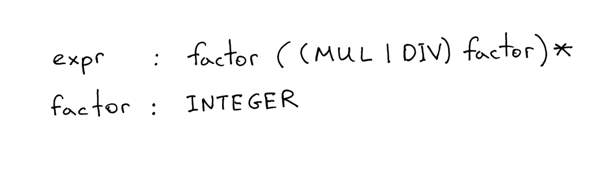
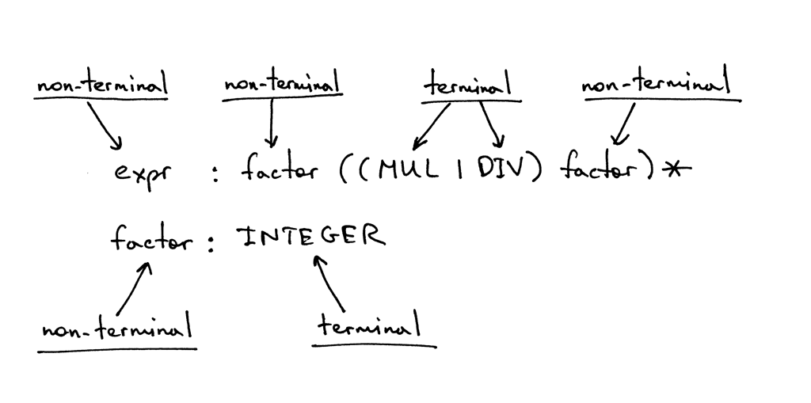
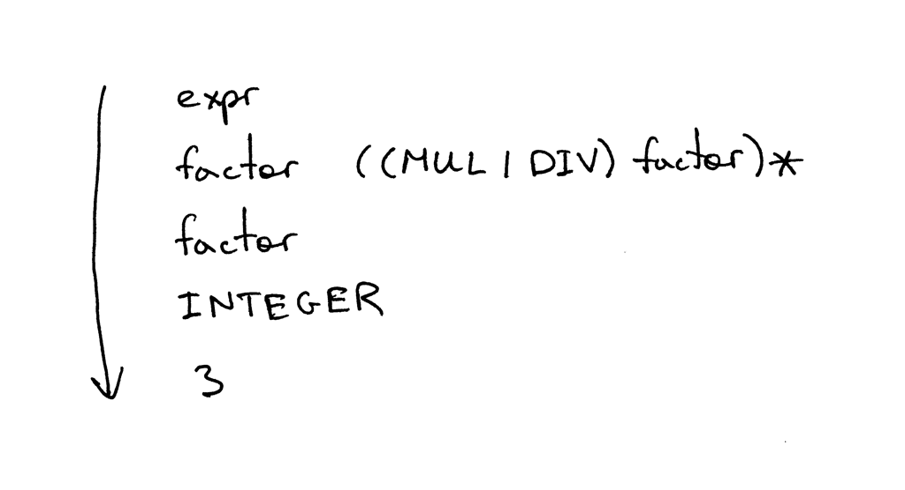

# 从零开始写个简单的解释器（4）

原文：[Let’s Build A Simple Interpreter. Part 4.](https://ruslanspivak.com/lsbasi-part4/)

译文：
你是被动地学习这些文章中的材料，还是一直在积极实践？我希望你一直在积极实践。我真的是这样想的 :)

还记得孔子说过什么吗？( 其实为孔子的弟子荀子在《儒孝篇》中的名句)
>不闻不若闻之


>闻之不若见之


>见之不若知之，知之不若行之


在上一篇文章中，你学习了如何解析（识别）和解释含有任意数量加减运算符的算术表达式，例如 "7 - 3 + 2 - 1"。你还学习了语法图，以及如何使用它们来确定编程语言的语法。

今天你要学习的是如何解析和解释其中包含任意数量的乘法和除法运算符的算术表达式，例如 "7 * 4 / 2 * 3"。本文中的除法将是整数除法，所以如果表达式是 "9 / 4"，那么答案将是一个整数：2。

今天我还会讲不少关于另一种被广泛使用的用于指定编程语言语法的符号。它叫做**上下文无关文法**（简称**文法**）或**BNF**（巴科斯范式 Backus-Naur Form）。在本文中，我不会使用纯粹的[BNF](https://en.wikipedia.org/wiki/Backus%E2%80%93Naur_Form)符号，而更像是一种修改过的[EBNF](https://en.wikipedia.org/wiki/Extended_Backus%E2%80%93Naur_Form)符号。

这里有几个使用语法的理由：

1. 语法以简明的方式规定了编程语言的语法。与语法图不同，语法非常紧凑。在以后的文章中，你会看到我越来越多地使用语法。
2. 语法本身也是很好的文档。
3. 即使你从头开始手动编写你的解析器，语法也是一个很好的起点。很多时候，你可以按照一套简单的规则将语法转换为代码。
4. 有一套工具，叫做解析器生成器，它接受一个语法作为输入，并根据这个语法自动为你生成一个解析器。我将在后面的系列文章中讲到这些工具。

现在，我们来谈谈语法的作用机制，如何？

这里有一个描述算术表达式的语法，比如 "7 * 4 / 2 * 3"（这只是该语法可以生成的众多表达式之一）。



语法由一连串的*规则*组成，也就是所谓的*生产*。在我们的语法中，有两条规则。


一条规则由一个*非终端*组成，称为生产的**头部**或**左侧**，一个冒号，以及终端和/或非终端的序列，称为生产的**主体**或**右侧**。


在我上面展示的语法中，像 MUL、DIV 和 INTEGER 这样的标记称为***终端***，像 *expr* 和*factor* 这样的变量称为***非终端***。非终端通常由一系列的终端和/或非终端组成。



第一条规则左侧的非终端符号称为***起始符号*** 。在我们的语法中，起始符号是 *expr*：


你可以把规则 *expr* 理解为："一个expr可以是一个*因数*，后面可以选择一个*乘法*或*除法*运算符，然后是另一个*因数*，而这个*因数*后面又可以选择一个*乘法*或*除法*运算符，然后是另一个*因数*，以此类推。"

什么是*因数*？在本文中，*因数*只是一个整数。
让我们快速了解一下语法中使用的符号及其含义。
- |-可选项。意思是 "或"。所以 (MUL | DIV) 表示 MUL 或 DIV。
- ( ... ) - 开括号和闭括号表示终端和/或非终端的分组，如 (MUL | DIV) 。
- ( ... )* - 在组内匹配内容零次或多次。

如果你曾使用过正则表达式，那么符号|、（）和（...）* 对你来说应该很熟悉。

语法通过解释可以生成什么句子来定义一种*语言*。这就是你如何使用语法*推导*出一个算术表达式的方法：首先你以起始符号 *expr* 开始，然后用该非终端的规则主体反复替换一个非终端，直到你生成了一个完全由终端组成的句子。这些句子构成了一种由语法定义的*语言*。

如果语法不能推导出某个算术表达式，那么它就不支持该表达式，解析器在试图识别该表达式时就会产生语法错误。

我觉得可以举几个例子。语法是这样推导出表达式 3 的：



语法就是这样推导出 3 * 7的表达式的：


然后语法就是这样推导出 3 * 7 / 2的表达式的：


哇，相当多的理论就在那里!

我想，当我第一次读到关于语法，相关的术语，以及所有的废话时，我的感觉是这样的：


我可以向你保证，我当时的感觉绝对不是这样的：


我花了一些时间来适应这些符号，来理解它是如何工作的，以及它与解析器和分词器的关系，但我必须告诉你，从长远来看，学习它是有好处的，因为它在实际应用和编译器文献中的使用非常广泛，你早晚会在某些时候碰到它。所以，为什么不早点学呢：)

以下是我们将用来将语法转换为源代码的指南。据此，你就可以把语法翻译成一个可用解析器。

- 语法中定义的每一条规则 **R**，都会成为一个同名的方法，对该规则的引用也会成为一个方法调用：***R()***. 方法的主体遵循规则主体的流程，使用相同的准则。
- 可选项**(a1 | a2 | aN)** 成为 ***if-elif-else*** 语句。
- 可多次匹配的分组 **(...)*** 成为一个 ***while*** 语句，可以循环0次或更多次。
- 每一个标记引用 **T** 都成为对方法 **eat：eat(T)** 的调用。*eat* 方法的工作方式是，如果标记 *T*与当前的*预期*的标记相匹配，它就会消耗这个标记，然后从分词器中获取一个新的标记，并将该标记赋值给current_token内部变量。

直观上来看，指南是这样的：


让我们开始行动起来，按照上面的准则将我们的语法转换为代码。

在我们的语法中，有两个规则：一个是 *expr* 规则，一个是 *factor* 规则。我们先说说factor规则（生产）。根据指南，你需要创建一个名为 *factor* 的方法（指南1），该方法有一个单次调用 *eat* 方法来消耗 INTEGER 标记（指南4）。

```python
def factor(self):
    self.eat(INTEGER)
```

这很容易，对不对？

继续!

规则 *expr* 成为 *expr* 方法(同样根据准则1)。规则的主体以对 *factor* 的引用开始，成为 *factor()* 方法调用。可选的分组 *(...)** 变成了一个 *while* 循环，*(MUL | DIV)* 备选方案变成了一个 *if-elif-else* 语句。通过将这些片段组合在一起，我们得到了下面的 *expr* 方法。

```python
def expr(self):
    self.factor()

    while self.current_token.type in (MUL, DIV):
        token = self.current_token
        if token.type == MUL:
            self.eat(MUL)
            self.factor()
        elif token.type == DIV:
            self.eat(DIV)
            self.factor()
```

请花点时间，研究一下我是如何将语法映射到源代码的。确保你理解这部分内容，理解之后后面的内容就容易理解了。

为了减轻你的负担，我把上面的代码放到了 *parser.py* 文件中，这个文件包含了一个词法器和一个没有解释器的解析器。你可以直接从 [GitHub](https://github.com/rspivak/lsbasi/blob/master/part4/parser.py) 上下载这个文件，然后玩一玩。它有一个交互式的提示，你可以输入表达式，并查看它们是否工作正常：也就是说，根据语法构建的解析器是否能识别表达式。

在我电脑上运行的一个示例会话：
```bash
$ python parser.py
calc> 3
calc> 3 * 7
calc> 3 * 7 / 2
calc> 3 *
Traceback (most recent call last):
  File "parser.py", line 155, in <module>
    main()
  File "parser.py", line 151, in main
    parser.parse()
  File "parser.py", line 136, in parse
    self.expr()
  File "parser.py", line 130, in expr
    self.factor()
  File "parser.py", line 114, in factor
    self.eat(INTEGER)
  File "parser.py", line 107, in eat
    self.error()
  File "parser.py", line 97, in error
    raise Exception('Invalid syntax')
Exception: Invalid syntax
```

试试看!

我忍不住又要提到语法图。同样的 *expr* 规则的语法图是这样的。


是时候深入研究一下我们新的算术表达式解释器的源代码了。下面是一个计算器的代码，它可以处理包含整数和任意数量的乘法和除法（整数除法）运算符的有效算术表达式。你还可以看到，我将词法分析器重构为一个独立的类 *Lexer* ，并更新了 *Interpreter* 类，以 *Lexer* 实例为参数。

```python
# 标记（Token）类型
#
# 标记EOF(end-of-file)用于表示
# 没有更多的输入需要进行词法分析。
INTEGER, MUL, DIV, EOF = 'INTEGER', 'MUL', 'DIV', 'EOF'


class Token(object):
    def __init__(self, type, value):
        # 标记类型: INTEGER, MUL, DIV, or EOF
        self.type = type
        # 标记值: 非负的整数, '*', '/', or None
        self.value = value

    def __str__(self):
        """类实例的字符串表示。

        例子：
            Token(INTEGER, 3)
            Token(MUL '*')
        """
        return 'Token({type}, {value})'.format(
            type=self.type,
            value=repr(self.value)
        )

    def __repr__(self):
        return self.__str__()


class Lexer(object):
    def __init__(self, text):
        # 输入的字符串，如： "3 * 5", "12 / 3 * 4"
        self.text = text
        # self.pos为指向self.text的索引
        self.pos = 0
        self.current_char = self.text[self.pos]

    def error(self):
        raise Exception('Invalid character')

    def advance(self):
        """推进 `pos` 指针并设置 `current_char` 变量。"""
        self.pos += 1
        if self.pos > len(self.text) - 1:
            self.current_char = None  # Indicates end of input
        else:
            self.current_char = self.text[self.pos]

    def skip_whitespace(self):
        while self.current_char is not None and self.current_char.isspace():
            self.advance()

    def integer(self):
        """返回一个从输入中并被消耗掉的（多位数）整数。"""
        result = ''
        while self.current_char is not None and self.current_char.isdigit():
            result += self.current_char
            self.advance()
        return int(result)

    def get_next_token(self):
        """词汇分析器(又称扫描器或标记器)

        此方法负责断句
        分开成标记。一次一个标记。
        """
        while self.current_char is not None:

            if self.current_char.isspace():
                self.skip_whitespace()
                continue

            if self.current_char.isdigit():
                return Token(INTEGER, self.integer())

            if self.current_char == '*':
                self.advance()
                return Token(MUL, '*')

            if self.current_char == '/':
                self.advance()
                return Token(DIV, '/')

            self.error()

        return Token(EOF, None)


class Interpreter(object):
    def __init__(self, lexer):
        self.lexer = lexer
        # 将当前的标记设置为输入中的第一个标记
        self.current_token = self.lexer.get_next_token()

    def error(self):
        raise Exception('Invalid syntax')

    def eat(self, token_type):
        # 比较当前标记的类型与传递进来的标记的类型，
        # 如果两者匹配，则 "吃掉"（eat）当前标记，
        # 并获取下一个标记分配给self.current_token，
        # 否则会抛出异常
        if self.current_token.type == token_type:
            self.current_token = self.lexer.get_next_token()
        else:
            self.error()

    def factor(self):
        """返回一个INTEGER标记值。

        factor : INTEGER
        """
        token = self.current_token
        self.eat(INTEGER)
        return token.value

    def expr(self):
        """算术表达式解析器/解释器。

        expr   : factor ((MUL | DIV) factor)*
        factor : INTEGER
        """
        result = self.factor()

        while self.current_token.type in (MUL, DIV):
            token = self.current_token
            if token.type == MUL:
                self.eat(MUL)
                result = result * self.factor()
            elif token.type == DIV:
                self.eat(DIV)
                result = result / self.factor()

        return result


def main():
    while True:
        try:
            # 在python3环境下，使用“input”代替“raw_input”
            text = raw_input('calc> ')
        except EOFError:
            break
        if not text:
            continue
        lexer = Lexer(text)
        interpreter = Interpreter(lexer)
        result = interpreter.expr()
        print(result)


if __name__ == '__main__':
    main()
```
将上面的代码保存为 *calc4.py* 文件，或者直接从 [GitHub](https://github.com/rspivak/lsbasi/blob/master/part4/calc4.py) 下载。跟以前一样，试一试，看看它是否工作正常。

这是我在电脑上运行的一个示例会话：

```bash
$ python calc4.py
calc> 7 * 4 / 2
14
calc> 7 * 4 / 2 * 3
42
calc> 10 * 4  * 2 * 3 / 8
30
```

我知道你已经迫不及待地想知道这部分的内容了：) 下面是今天的新练习：


- 写一个语法来描述包含任意数量的+、-、*或/运算符的算术表达式。利用该语法，你应该能够推导出 "2 + 7 * 4"、"7 - 8 / 4"、"14 + 2 * 3 - 6 / 2 "等表达式。
- 使用该语法，编写一个解释器，它可以运算包含任意数量的+、-、*或/运算符的算术表达式。你的解释器应该能够处理 "2 + 7 * 4"、"7 - 8 / 4"、"14 + 2 * 3 - 6 / 2 "等表达式。
如果你已经完成了上述练习，请放松并享受:)
。

**检查你是否理解了**

牢记今天文章中的语法，根据需要参照下图，回答下列问题：


1. 什么是上下文无关语法（grammar）？
2. 语法有多少条规则/产物？
3. 什么是终端？(找出图片中的所有终端)
4. 什么是非终端？(找出图片中所有的非终端)
5. 什么是规则的头？(找出图中所有的头/左手边)
6. 什么是规则的主体？(找出图中所有的主体/右侧)
7. 语法的起始符号是什么？

嘿，你都读到最后了! 这篇文章包含了相当多的理论，所以我真的为你完成它而感到骄傲。

下一次我会带着新的文章回来--敬请期待，别忘了通过做练习帮你巩固知识。

下面是我推荐的书单，它们对你学习解释器和编译器非常有帮助：
1. [Language Implementation Patterns: Create Your Own Domain-Specific and General Programming Languages (Pragmatic Programmers)](http://www.amazon.com/gp/product/193435645X/ref=as_li_tl?ie=UTF8&camp=1789&creative=9325&creativeASIN=193435645X&linkCode=as2&tag=russblo0b-20&linkId=MP4DCXDV6DJMEJBL)

2.  [Writing Compilers and Interpreters: A Software Engineering Approach](http://www.amazon.com/gp/product/0470177071/ref=as_li_tl?ie=UTF8&camp=1789&creative=9325&creativeASIN=0470177071&linkCode=as2&tag=russblo0b-20&linkId=UCLGQTPIYSWYKRRM)

3.  [Modern Compiler Implementation in Java](http://www.amazon.com/gp/product/052182060X/ref=as_li_tl?ie=UTF8&camp=1789&creative=9325&creativeASIN=052182060X&linkCode=as2&tag=russblo0b-20&linkId=ZSKKZMV7YWR22NMW)

4.  [Modern Compiler Design](http://www.amazon.com/gp/product/1461446988/ref=as_li_tl?ie=UTF8&camp=1789&creative=9325&creativeASIN=1461446988&linkCode=as2&tag=russblo0b-20&linkId=PAXWJP5WCPZ7RKRD)

5.  [Compilers: Principles, Techniques, and Tools (2nd Edition)](http://www.amazon.com/gp/product/0321486811/ref=as_li_tl?ie=UTF8&camp=1789&creative=9325&creativeASIN=0321486811&linkCode=as2&tag=russblo0b-20&linkId=GOEGDQG4HIHU56FQ)